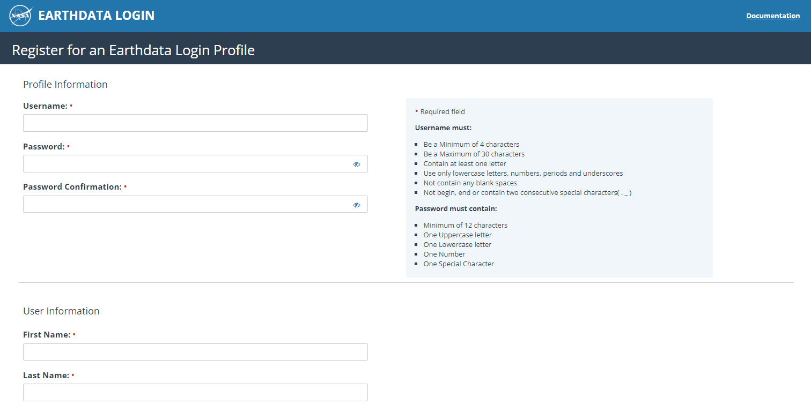
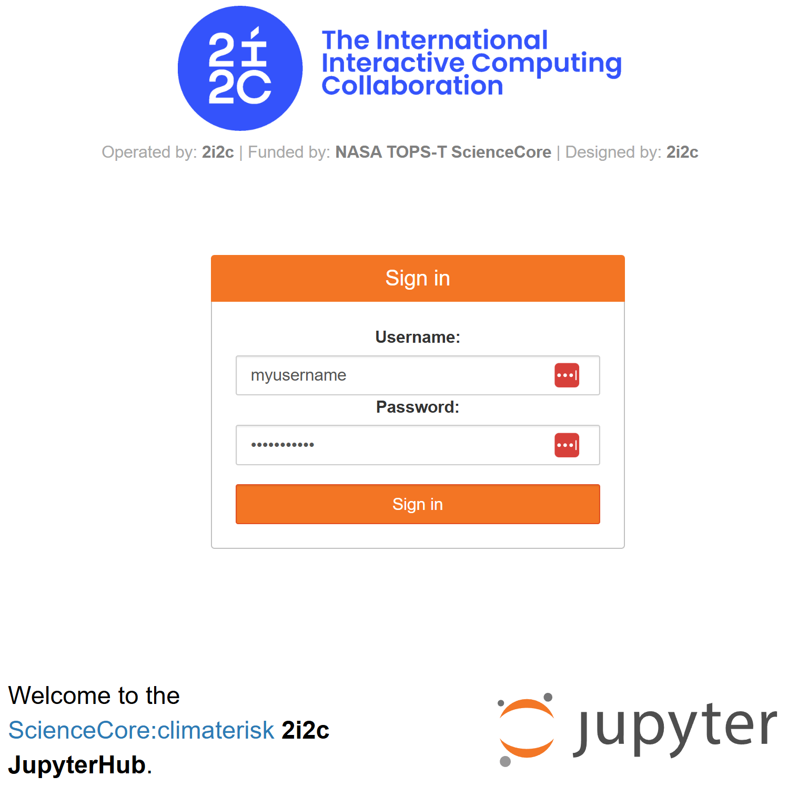
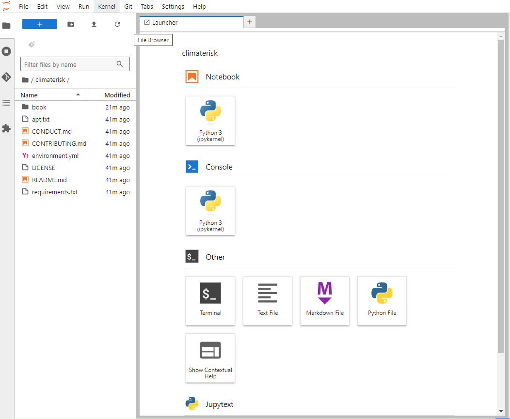

# Initial Setup 

## 1. Setting up a NASA Earthdata Account

**You can complete this step before the day of the actual tutorial.**

### Brief Introduction

The [NASA Earth Science Data Systems (ESDS) program oversees the lifecycle of Earth science data from all its Earth observation missions, from acquisition to processing and distribution.

For the purposes of this guide, the NASA Earthdata website is the entry point that allows full, free and open access to NASA's Earth science data collections, in order to accelerate scientific progress for the benefit of society. To access the data through this portal, users must first define their access credentials. To create an EarthData account, follow these steps:

+ Go to the Earth Nasa website: [`https://www.earthdata.nasa.gov/`](https://www.earthdata.nasa.gov/). Then, select the menu options "*Use Data*" and then "*Register*". Finally, navigate to [`https://urs.earthdata.nasa.gov/`](https://urs.earthdata.nasa.gov/).

 

+ Select the "*Register for a profile*" option, there choose a username and password. You will need these later, so choose ones that you remember well. You will also need to complete your profile to complete the registration, where you will be asked for information such as email, country, and affiliation. Finally, choose "*Register for Earthdata Login*".




## 2. Logging into the 2i2c Hub

**You won't be able to complete this step until the actual day of the tutorial (you'll get the password then).**

We will cloud infrastructure provided by [2i2c](https://2i2c.org) for this tutorial.

To login to the hub provided by 2i2c, follow these steps:

1. **Navigate to the 2i2c Hub:** Point your web browser to [this link](https://climaterisk.opensci.2i2c.cloud).

2. **Log in with your Credentials:**

  + **Username:** Feel free to choose any username you like.  We suggest using your GitHub username to avoid conflicts.
  + **Password:** You'll receive the password on the day of the tutorial.




3. **Logging In:**

The login process might take a few minutes, especially if a new virtual workspace needs to be created just for you. 


* **What to Expect:**

By default,  logging into [`https://climaterisk.opensci.2i2c.cloud`](https://climaterisk.opensci.2i2c.cloud) automatically clones a repository to work in. If the login is successful, you will see the following screen and are ready to start working. 

 

**Notes:** Any files you work on will persist between sessions as long as you use the same username when logging in. 

## 3. Configuring the Cloud Environment Access NASA EarthData from Python

To access NASA's EarthData products from Python programs or Jupyter notebooks, it is necessary to save your NASA EarthData credentials in a special file called `.netrc` in your home directory.

+ You can create this file by executing the script `make_netrc.py` in a terminal:
  ```bash
  $ python make_netrc.py
  ```
  Running this script will prompt you for your NASA EarthData username and password; enter those appropriately at the command prompt.

+ Alternatively, you can create a file called `.netrc` in your home folder (i.e., `~/.netrc`) with content as follows:
```
machine urs.earthdata.nasa.gov login USERNAME password PASSWORD
```
Of course, you would replace USERNAME and PASSWORD in your `.netrc` file with your actual NASA EarthData account details. Once the `.netrc` file is saved with your correct credentials, it's good practice to restrict access to the file:
```bash
$ chmod 600 ~/.netrc
```

## 4. Verifying Access to NASA EarthData Products

To make sure everything is working properly, execute the script `test_netrc.py`:
```bash
$ python test_netrc.py
```
If that works smoothly, you're done! You now have everything you need to explore NASA's Earth observation data through the EarthData portal!
